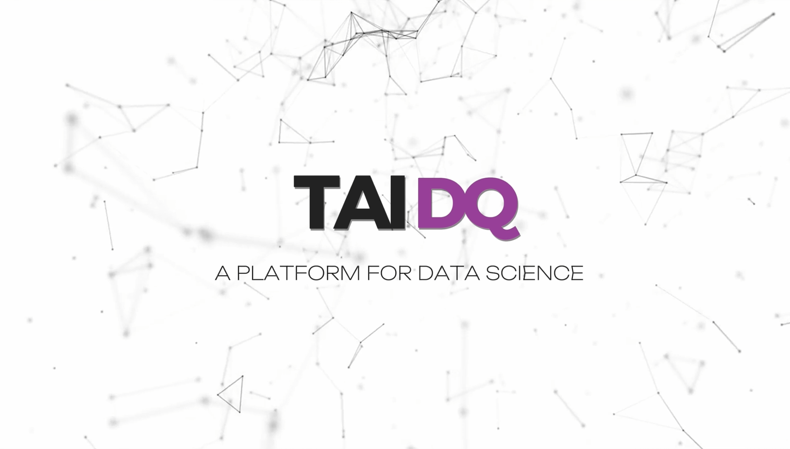

# TAI DQ

[](https://youtu.be/w3JulScsLXU)

#### (Click the image for demo video!)

# Project Overview

TAI DQ focuses on two major themes: **Data Quality (DQ)** and **Explainable AI (XAI)**. The project aims to automate workflows, reduce data processing costs, and enhance reliability.

### Data Quality (DQ)

[Explore the DQ Repository](https://github.com/kogby/EDASH)

- Implements **parametric** and **non-parametric imputation methods** to improve data usability.
- Evaluates imputation results using:
  - **Differential Entropy**
  - **Canonical Relative Entropy**
  - Correlation-based metrics

### Explainable AI (XAI)

- Incorporates **Active Learning** for interactive and adaptive workflows.
- Ensures process stability and reduces parameters through **Knowledge Distillation**.
- Enhances model interpretability with:
  - **SHAP (SHapley Additive exPlanations)**
  - **Counterfactual Explanations**

These methods assist in informed and transparent decision-making.

### Additional Resources

- [Presentation PPT](./專題簡報.pdf)
- [Poster](./image/Poster.png)

---

# Website Preview


- **Frontend:** React, Tailwind CSS
- **Backend:** Django, PostgreSQL (containerized with Docker)

## Setup Instructions

### Prerequisites

- [Docker Desktop](https://www.docker.com/products/docker-desktop)
- [Node.js & npm](https://nodejs.org/) (for frontend)

### Frontend Setup

Run the frontend on `http://localhost:5173/`:

```bash
cd frontend
npm install
npm run dev
```

### Backend & Database Setup

The backend is containerized using Docker Compose. To set it up:

1. Start Docker Desktop.
2. Build and start the backend and database:

```bash
cd backend
docker compose up --build
```

#### Restarting Backend (Optional)

If Docker is already set up, restart the backend without rebuilding:

```bash
docker compose up
```

---

## Notes

- **CORS Policy**: Configured using a Vite proxy.

## Contact

For questions or issues, raise a GitHub issue or contact the project maintainers.

Enjoy exploring TAI DQ! 🚀
